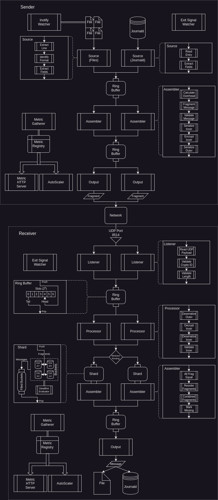

# Architecture/Design Specification

This document covers the architecture and design specific to this implementation of the protocol.

For details about the protocol, see `Protocol.md`.

The goal:

- Implement the protocol in a system to transport log messages securely across a network
- Prioritize message integrity and total message throughput

## Overview

## Sending Mode

### Sending Pipeline

Stage 1 - Listener (fixed - no scaling)

- One thread started per input type
  - File
  - Journald
  - Syslog
- Reads any metadata (if any) from the specific source and attaches to message.
- Parses message text and extracts relevant metadata into common format
- Pushes to central assembly queue

Stage 2 - Assembler (dynamic scaling)

- Reads from central assembly queue
- Constructs fragmented messages conforming to output transport protocol
- Serializes and encrypts fragments
- Pushes fragments to central sender queue (non-blocking)

Stage 3 - Senders (dynamic scaling)

- Reads fragments from center sender queue
- Blocks until packet can safely be enqueued at the OS-level
- Sends fragments to configured destination

### Sending Queues

Stage 1 to Stage 2 is a shared ring buffer queue.

- Contains the common format log message text and metadata.
- Blocking for file/journal sources on producer side.
- Non-blocking for syslog sources on producer side.
- Blocking for consumer side.

Stage 2 to Stage 3 is a shared mostly-unbounded queue.

- Contains raw byte slices of actual packet payload.
- High memory usage/disk usage to ensure messages are not dropped unless absolutely necessary for system stability.
- Fragments are buffered here until they can be safely sent across the network.
  - Safe defined as interfaces are up, and OS-level buffers can accept messages.
- Messages shall be buffered in memory until reaching a high water mark, then buffered on disk.
- High-water watcher shall ensure that the program shall not consume all system memory (triggering oom killer).
  - Disk queue shall be bounded and then dropped when exceeding bounds.

## Receiving Mode

Deadline definition can be found in `Protocol.md`.

### Processing Pipeline

Stage 1 - Listeners

- Reads packets from network (scaled horizontally via port reuse)
- Conducts pre-validation checks in order:
  - Discards if payload is not the protocol's minimum length
  - Peeks first byte to validate crypto suite ID (discards immediately if invalid)
- Pushes transport payload into queue

Stage 2 - Processors

- Reads payloads from queue
- Marks processing begin time
- Deconstructs and validates byte payload:
  - Parsing/Validation of outer payload
  - Decryption of the inner payload
  - Parsing/Validation of inner payload
- Choose a destination shard: Hash of source IP, host ID, log ID modulus the current number of shards
- Fragment is pushed into a bucket within the shard
  - Processing start time for each newest fragment is attached to each bucket (every time)
  - When the seq == seqmax has been reached for a given bucket, the bucket is considered filled
  - Then it puts the 'filled' shard bucket key into a FIFO channel for that shard

Stage 3 - Assemblers

- Separate watcher thread is started per assembler/shard to evaluate bucket deadlines on a polling basis - marks buckets as complete if they exceed deadline
- Blocking read on the shards' bucket key FIFO queue waiting for 'filled' buckets
- Upon receiving a 'filled' bucket key, the assembler will defragment the messages in the bucket:
  - Validate all fragments are equal
  - Sort partial messages into order
  - Combined messages into single message inserting placeholder text where there are missing sequence numbers
  - Place final messages into central output worker queue

Stage 4 - IOWorker

- Removes events from central queue
- Copy send to each destination by external source(s):
  - File
  - Journald
  - Syslog
- Pushes events to configured external source(s)

### Receiver Queues

Stage 1 to Stage 2 will share a single queue and operate on a lock-free ring buffer.

Stage 2 to Stage 3 is a sharded queue with one assembler for each shard (and deadline evaluator).

- Shard - Containing:
  - Buckets keyed on unique identifiers
  - Assembler bucket key queue (first-in first-out)
- Bucket - Containing:
  - All message fragment objects

Stage 3 to Stage 4 will share a single queue and operate on a lock-free ring buffer.

Note: all metric variables within queue objects are atomic read/write to allow for lock-less metric gathering.

## Shutdown Sequence

If the program is being shutdown (internally or external signal):

Receiver:

- If on Linux (eBPF supported), mark sockets as draining to prevent additional packets from being read
- Wait for OS socket buffers to empty
- Close all listener sockets
- Manager issues cancel to listener workers
- Manager waits for listener workers to exit
- Walk through each stage:
  - Watch inbox queue until empty
  - Issue cancel to worker(s)
  - Wait for worker to exit

Sender:

- Manager issues cancel to reader workers
- Manager waits for workers to exit
- Reader workers save read positions in state file
- Reader workers exit
- Walk through each stage:
  - Watch inbox queue until empty
  - Issue cancel to worker(s)
  - Wait for worker to exit

## Input/Output Modules

Note: Even though these modules are not run concurrently with each other (multiple inputs/multiple outputs), they must still remain concurrent/multi-process safe.
This is to maintain the continuity of operation during in-place upgrades (where two processes could be writing (different messages) to the same output).

Modules must satisfy this minimum contract:

- function `NewInput`
  - Takes: `namespace []string`, `baseStateFile string`, `outbox *mpmc.Queue[global.ParsedMessage]`, optional values...
  - Returns: `*InModule`, `error`
- function `NewOutput`
  - Takes: optional values...
  - Returns: `*OutModule`, `error`
- type `InModule`
  - Methods:
    - Reader - Go routine
      - Takes: `context.Context`
      - Returns: nothing
    - CollectMetrics
      - Takes: `interval time.Duration`
      - Returns: `[]metrics.Metric`
    - Shutdown - Gracefully terminates any resources
      - Takes: nothing
      - Returns: `error`
- type `OutModule`
  - Methods:
    - Write
      - Takes: `context.Context`, `protocol.Payload`
      - Returns: `int`, `error` (first return is number of entries written, likely 1 unless batching internally)
    - CollectMetrics
      - Takes: `interval time.Duration`
      - Returns: `[]metrics.Metric`
    - Shutdown - Gracefully terminates any resources
      - Takes: nothing
      - Returns: `error`

## Self Updater

The program can self update without dropping any traffic by starting a temporary process to continue processing messages while the primary process replaces itself.

Two-Stage Hot Swap Process:

- Primary_Process     - Receives signal SIGHUP
- Primary_Process     - Create communication pipe
- Primary_Process     - Signal handler starts Temp_Process (child) with shared pipe via environment variable (for FD number)
- Primary_Process     - Wait for Temp_Process to signal it is fully started with Read pipe
- Temp_Process        - Start daemon
- Temp_Process        - Once daemon is started, send readiness signal to Primary_Process (parent)
- Primary_Process     - Receives Temp_Process readiness signal
- Primary_Process     - Set update environment variable with Temp_Process PID for next in-place program
- Primary_Process     - Start shutdown process
- Primary_Process     - Daemon shutdown succeeds
- Primary_Process     - Right before normal os exit, re-exec self with new binary file from disk
- Primary_Process_New - Start all components
- Primary_Process_New - All components successfully started
- Primary_Process_New - Notifies systemd READY (if under systemd)
- Primary_Process_New - Check for update environment variable
- Primary_Process_New - If update environment variable exists, get value (Temp_Process pid)
- Primary_Process_New - Send signal SIGTERM to Temp_Process PID
- Temp_Process        - Receive SIGTERM signal
- Temp_Process        - Starts normal shutdown procedure
- Primary_Process_New - Cleans up exited Temp_Process
- Primary_Process_New - Continues on as normal

## Encryption

Ephemeral private keys are generated randomly on the sender and used in conjunction with a pre-shared receiver public key to created a shared secret.
The shared secret shall be used in conjunction with a key derivation function to generate a secure symmetric encryption key.
Symmetric encryption key will be used to encrypt the payload.

Cipher suite ID, Ephemeral public key, and the symmetric encryption cipher nonce, are sent over the wire.

Receiver side will use the received ephemeral public key and it's persistent private key to recreate the shared secret.
The shared secret will be put through the same key derivation function to recreate the symmetric encryption key.
Symmetric encryption key will be used to decrypt the payload.
